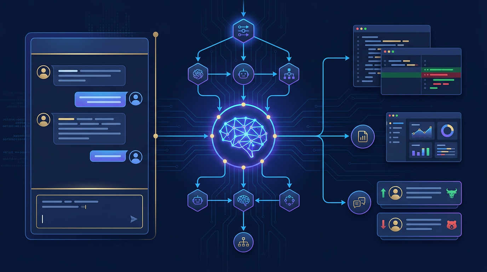
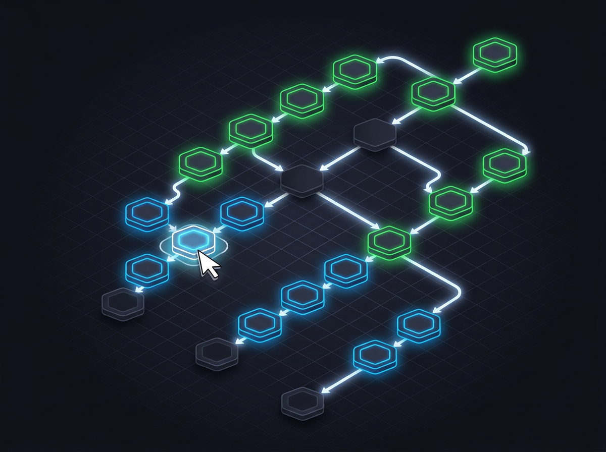

<div align="center">

# 🧠 EasyAI

### Use AI to Create AI — 用自然语言构建、编排、运行多 Agent 协作系统

[](LICENSE)
[](https://kotlinlang.org)
[](https://spring.io)
[](https://react.dev)



[⬇️ Quick Start](#-quick-start) · [✨ Examples](easyai-examples/) · [🏗️ Architecture](#-architecture) · [🇨🇳 中文版](README_CN.md)

</div>

---

## 🤔 What Is EasyAI?

EasyAI is a **full-stack LLM Agent framework** (Kotlin / Spring Boot) with desktop and web clients. You describe what you want in plain language — EasyAI generates the agents, assigns tools, orchestrates the team, and streams every step back to you in real time.

**Core components:**

- 🔄 **ReAct Agent Loop** — fully controllable `call → tool → observe → repeat` cycle
- 🐝 **Swarm Runtime** — DAG-based multi-agent orchestration: parallel teams + adversarial debates with judge
- 🪄 **AI Config Generator** — natural language → complete Agent / Workflow configs, with built-in validate → fix loop
- 🖥️ **Desktop + Web Client** — one download: bundled JRE, embedded database, zero runtime setup

**Why EasyAI?**

- Other frameworks: write YAML/JSON configs → EasyAI: **describe in natural language, AI generates & validates**
- Other frameworks: sequential agent chains → EasyAI: **DAG orchestration + multi-round judge-ruled debates**
- Other frameworks: CLI-only → EasyAI: **visual workflow editor + full chat console + desktop app**

---

## ✨ Key Features

<table>
<tr>
<td width="50%">

### 🏛️ AI Deliberation Debates


- Multi-round **Bull vs Bear** adversarial debates
- Judge autonomously decides when consensus converges
- Personalized prompts per participant, per round
- Eliminates single-agent analysis bias

</td>
<td width="50%">

### 🪄 AI Creates AI


- Describe needs → AI generates complete agent configs
- Built-in validate → fix loop guarantees correctness
- Resource-aware: discovers your tools & MCP servers
- Iterative refinement via conversation ("remove QA, add a DBA")

</td>
</tr>
<tr>
<td width="50%">

### 🌐 DAG Swarm Orchestration



- Visual drag-and-drop workflow editor
- SINGLE / TEAM / DELIBERATION task types
- Parallel execution with dependency resolution
- Real-time progress streaming via SSE

</td>
<td width="50%">

### 📦 One Download, Zero Setup


- Bundled JRE + fat jar — no JDK required
- Embedded H2 database — no PostgreSQL required
- macOS (DMG) / Windows (NSIS) / Linux (AppImage)
- Auto-update with native notifications

</td>
</tr>
</table>

---

## 🚀 What You Can Do

| Task | How | Output |
|------|-----|--------|
| Run a 14-agent investment analysis | Paste one prompt → AI generates the full DAG | 4D reports + Bull/Bear debate + structured trade plan |
| Deploy a 6-expert coding team | Paste one prompt → AI generates a TEAM agent | Research → Implement → Test → Review, in parallel |
| Create a custom agent in 30 seconds | Describe the role in natural language | Complete agent with tools + permissions |
| 100+ turn deep research sessions | Memory system + context compaction | Context never lost, auto-summarized |
| Integrate any external tool | Connect an MCP server in the UI | Agent instantly gains new capabilities |
| Modify code with a safety net | Git snapshot before every change | One-click revert to any checkpoint |

---

## ⚡ Quick Start

### Option A: Desktop App (Recommended · ~5 minutes)

```bash
# 1. Build the desktop app (requires JDK 21+, Node 20+)
cd easyai-desktop
scripts/build-backend.sh          # console dist → fat jar
scripts/fetch-jre.sh              # bundle Temurin JRE 21
npm ci && npm run desktop:build   # → DMG / NSIS / AppImage

# 2. Install & launch — embedded JRE + H2 database, zero runtime config
# 3. Open Settings → configure your LLM API key (DashScope / OpenAI / Anthropic)
```

### Try the Examples ✨

Every example is a **carefully crafted prompt** — copy, paste, generate, done. See [easyai-examples/](easyai-examples/) for full guides.

**🧑‍💻 Coding Team** — 6 experts (Researcher, Engineer, QA, Reviewer, UI Operator, Debugger) collaborate on your code:

> Agents → Create Agent → ✨ AI Panel → paste the [prompt](easyai-examples/coding-team/) → Generate → Apply → Save

**📈 Investment Analysis** — 14 AI analysts form an investment committee with bull-vs-bear debates:

> Workflow → Create Preset → ✨ AI Panel → paste the [prompt](easyai-examples/investment-analysis/) → Generate → Apply → Save → Run

### Option B: Dev Server from Source

```bash
# Backend (JDK 21+)
cd easyai && ./mvnw clean install
cd ../easyai-apps && ./mvnw spring-boot:run -pl easyai-web-server   # → :8080

# Frontend (Node 20+)
cd easyai-console && npm ci && npm run dev                          # → :5173
```

Open `http://localhost:5173` → Settings → configure your LLM API key → start chatting.

---

## 🏗️ Architecture

```
┌───────────────────────────────────────────────────────────┐
│                Desktop Shell (Electron)                     │
│  ┌─────────────────────────────────────────────────────┐  │
│  │          Web Console (React + Vite + TailwindCSS)    │  │
│  │   Chat │ Agents │ Workflow DAG │ MCP │ Memories      │  │
│  └─────────────────────────────────────────────────────┘  │
├───────────────────────────────────────────────────────────┤
│              Spring Boot Backend (Kotlin)                   │
│  ┌──────────┐ ┌──────────┐ ┌──────────┐ ┌─────────────┐  │
│  │  ReAct   │ │  Swarm   │ │  Skills  │ │  Context    │  │
│  │  Agent   │ │  Runtime │ │  & Sub-  │ │  Compaction │  │
│  │  Loop    │ │  (DAG)   │ │  Agents  │ │             │  │
│  └──────────┘ └──────────┘ └──────────┘ └─────────────┘  │
│  ┌─────────────────────────────────────────────────────┐  │
│  │  Tools: file │ search │ shell │ web │ MCP │ memory   │  │
│  │         goal │ todo │ question │ calc                │  │
│  └─────────────────────────────────────────────────────┘  │
│  SSE Streaming │ JWT Auth │ Permission │ Exposed R2DBC    │
└───────────────────────────────────────────────────────────┘
```

| Project | Path | Tech | Purpose |
|---------|------|------|---------|
| easyai | `easyai/` | Kotlin 2.3 / Spring Boot 4.1 | LLM harness framework (agent loop, tools, swarm, SSE, persistence) |
| easyai-console | `easyai-console/` | React 18 / TypeScript / Vite 6 | Web console (chat, agents, workflow, MCP, memories) |
| easyai-apps | `easyai-apps/` | Kotlin / Spring Boot | Runnable servers (web + desktop backend) |
| easyai-desktop | `easyai-desktop/` | Electron 33 / esbuild | Desktop shell: spawns fat jar with bundled JRE |
| easyai-examples | `easyai-examples/` | Prompts | Learn-by-doing: paste a prompt, AI builds the rest |

---

## 🛠️ Tech Stack

<p align="center">
  
  
  
  
  
  
  
  
  
</p>

---

## 🔬 Under the Hood — Engineering Highlights

EasyAI is not a thin wrapper around LLM APIs. It's a **production-grade agent runtime** built from the ground up with Kotlin coroutines. Here's what's inside:

### 🔄 Fully Controllable ReAct Loop

- **Hand-rolled agent loop** — not Spring AI's built-in tool calling. Every iteration is inspectable, interruptible, and extensible.
- **3-phase tool execution**: permission check → parallel batch execution → post-hooks. Blocked tools auto-skip remaining calls.
- **Completion Check bonus iterations** — Goal-driven agents can grant themselves extra turns (budget-capped) to finish work.
- **Context overflow self-healing** — detects LLM token-limit errors, auto-compacts context, and retries transparently.
- **Runtime message injection** — steering/follow-up messages can be injected mid-loop with late-arrival catch-up logic.

### 📡 Channel-Based Event Streaming

- `EventStream<TEvent, TResult>` built on Kotlin `Channel` + `CompletableDeferred` — producer/consumer fully decoupled.
- 15+ typed SSE events (thinking, tool lifecycle, permission requests, compaction, sub-agent forwarding).
- Sub-agent events transparently enriched with parent context (`withSubAgentContext`) for nested rendering.
- `CustomEvent` extension point — inject domain events without modifying the sealed hierarchy.

### 🐝 DAG Swarm Orchestration

- **Kahn's algorithm** for layer-based topological scheduling — same-layer tasks run in parallel, layers execute sequentially.
- **DFS cycle detection** (white-gray-black coloring) with human-readable cycle path reporting.
- **Failure cascade** — BFS propagation marks all transitive dependents as BLOCKED.
- **Semaphore-bounded concurrency** + runtime pause/resume/cancel via atomic signals.

### ⚔️ AI Deliberation Debates

- Judge uses a **neutral orchestrator prompt** (persona stripped) to eliminate bias during facilitation.
- Each round: Judge reviews full history → generates **personalized prompts** per participant (JSON Schema constrained).
- **Autonomous convergence** — Judge decides when consensus is reached via structured `converged` output.
- **Resume from checkpoint** — rebuilds token counters and locates last completed round on restart.

### 👥 Leader-Member Reactive Teams

- Event-driven coordination: member results flow through a `Channel`, debounced/drained, then presented to Leader.
- Leader outputs **structured decisions** (new tasks, reassignments, suspend-and-assist, user consultation).
- Members can be **blocked, assisted by peers, or escalated** — the Leader adapts dynamically.
- Full persistence: round records + member executions enable crash recovery and resume.

### 🗜️ Incremental Context Compaction

- **Bounded data per round**: only "previous summary + new messages" — never reloads full history.
- Three triggers: Auto (token threshold), Manual, Overflow (emergency post-error compression).
- `UsageAwareTokenEstimator` — calibrates chars/token ratio from actual LLM usage feedback.
- Extracts **session variables** during compaction for real-time frontend state.

### 🔐 Defense-in-Depth Permission System

- **Open-Closed design** — each ToolBuilder declares its own `permissionEvaluator`; new tools need zero core changes.
- Shell commands classified into 3 safety tiers (SAFE_READ / SAFE_WRITE / UNSAFE) with compound-command splitting.
- Git subcommand granularity: `git log` auto-approved, `git push` requires explicit consent.
- Permission requests pause the agent loop via SSE → frontend approval card → resume.

### 📸 Shadow Git Snapshots

- **Independent Git repository** per project (`--git-dir` isolated) — never pollutes your project's `.git` history.
- Author attribution: distinguishes USER commits from LLM_AGENT commits (agent ID encoded in author name).
- Per-repo `Mutex` prevents concurrent snapshot writes; file-level revert to any checkpoint.

### ⚡ Resilience & Error Classification

- Type-safe error classification via Spring AI exception hierarchy (`NonTransientAiException` / `TransientAiException`).
- 4-level detection: structured exception → HTTP status → provider-specific → keyword fallback.
- Cross-provider robustness: OpenAI, Anthropic, DashScope handled uniformly.
- Dual stream-stall detection: 240s TTFT timeout + 120s inter-chunk idle timeout (independent of HTTP layer).

### 🔌 Async MCP Integration

- `McpAsyncClient` with Reactor Mono → coroutine `awaitSingle` bridge — fully non-blocking.
- Per-user lazy initialization with double-check locking; system servers connect at startup.
- Supports both **Stdio** and **StreamableHTTP** transports with per-user-per-server tool caching.

---

## 🤝 Contributing

Contributions are welcome! Please read [CONTRIBUTING.md](CONTRIBUTING.md) for development setup, code style, and PR process.

## 📄 License

[Apache License 2.0](LICENSE)
